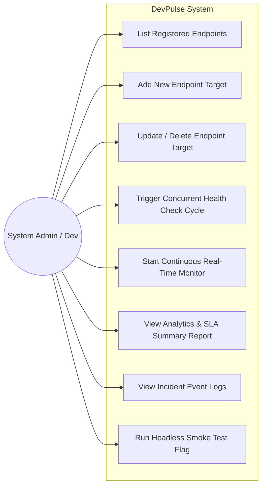
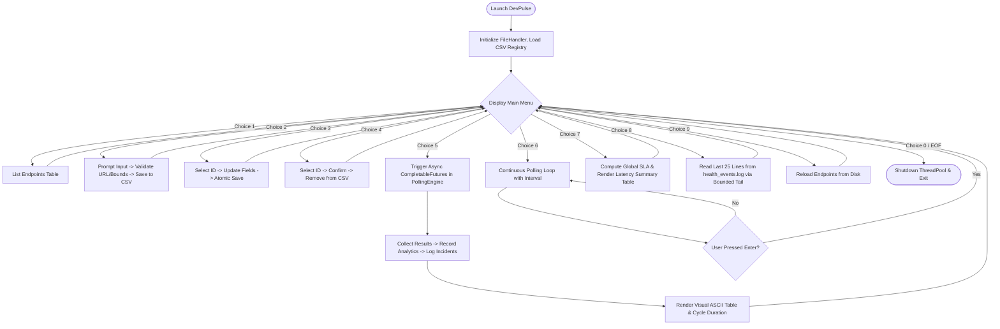
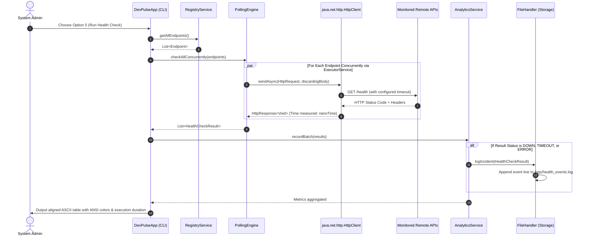
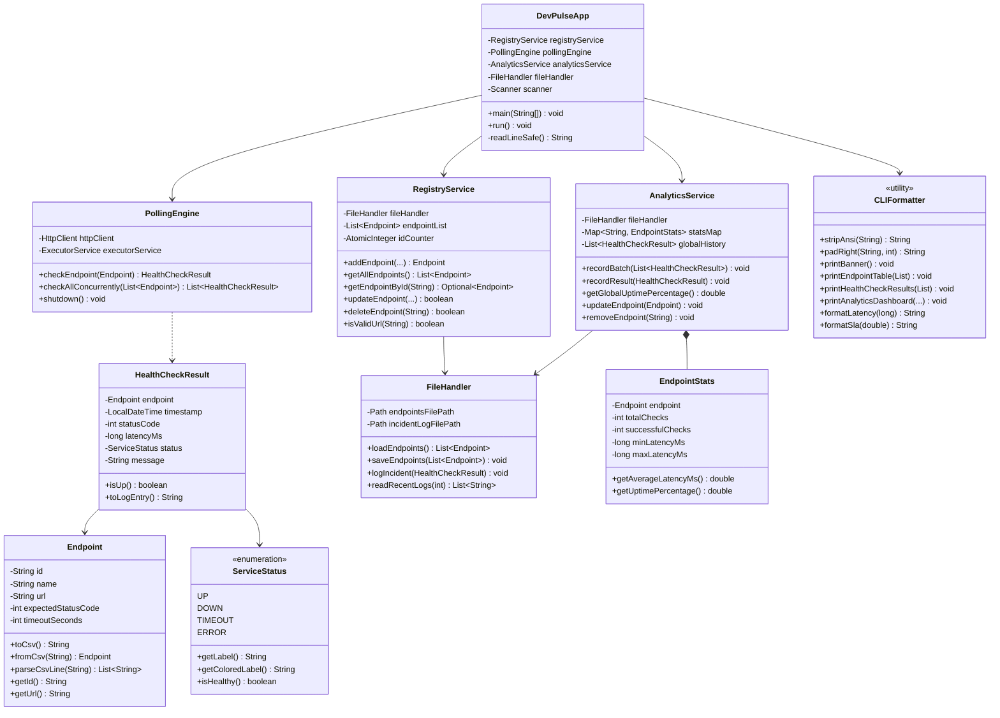

# DevPulse: Server & API Health Monitoring CLI
## Comprehensive Project Report & Academic Documentation

---

# 1. Cover Page

```
================================================================================
                               PROJECT REPORT
                                     ON
            DEVPULSE: SERVER & API HEALTH MONITORING CLI
================================================================================

Course Title:       Flipped Course Evaluation / Advanced Object-Oriented Programming
Degree / Program:   Bachelor of Technology in Computer Science & Engineering
Institution:        Vellore Institute of Technology (VIT) / VITyarthi
Project Title:      DevPulse: Server & API Health Monitoring CLI
Student Name:       Mohit Nagar
Submission Date:    September 2026
Technology Stack:   Java 11+ (Tested on OpenJDK 25 LTS), Git, CLI Architecture
Architecture:       3-Tier Layered Architecture (Presentation, Service, Data Access)

================================================================================
```

---

# 2. Introduction

Modern software engineering is dominated by distributed microservices, RESTful APIs, and cloud-native infrastructure. Software systems are split into dozens or hundreds of decoupled services that interact over the network. In such complex environments, network degradation, latency spikes, and sudden service outages can cascade through interdependent components, severely undermining user experience and business operations.

While enterprise Application Performance Monitoring (APM) tools such as Datadog, New Relic, and Dynatrace provide rich observability, they introduce significant drawbacks: they are resource-intensive, closed-source or costly, require complex agent installations, and depend heavily on web-based Graphical User Interfaces (GUIs). When system administrators, DevOps engineers, or backend developers work in constrained terminal environments (such as remote SSH bastions, minimal container images, or continuous integration pipelines), graphical tools are inaccessible and inappropriate.

**DevPulse** was conceived and engineered to resolve this disparity. It is an autonomous, lightweight, and high-performance Command-Line Interface (CLI) application built exclusively in **pure Java (JDK 11+)** with zero external dependencies. DevPulse leverages non-blocking asynchronous concurrency (`CompletableFuture` and `java.net.http.HttpClient`) to poll dozens of remote endpoints in parallel, records response times with sub-millisecond precision, calculates real-time Service Level Agreement (SLA) uptime statistics, and persistently audits incidents to local storage.

---

# 3. Problem Statement

In software organizations managing multi-tiered web architectures, developers and administrators face the following key challenges:

1. **Tedious Manual Verification**: Manually validating service availability using traditional tools like `curl` or basic `ping` is sequential, time-consuming, and limited to single endpoints or ICMP network layers.
2. **Lack of Terminal-Native Concurrency**: Sequential HTTP scripts scale linearly ($O(N)$) with network latency. Probing 50 endpoints with 200ms latency takes 10 seconds sequentially, causing stale metrics.
3. **Absence of Persistent Benchmarking & Auditing**: Ad-hoc CLI queries lack built-in local configuration persistence, historical latency benchmarking, and automated incident event logging.
4. **Heavy GUI Overheads**: GUI and web-based monitoring dashboards consume significant RAM and CPU, preventing deployment in minimal cloud servers or SSH terminal environments.

**DevPulse directly solves these problems** by offering a terminal-based CLI tool that concurrently executes health checks across all configured targets, calculates min/avg/max latency distributions and SLA uptime percentages, persistently stores configuration in RFC-4180 compliant CSV, and appends failure incidents to an audit log—all within a clean, color-coded ASCII terminal dashboard.

---

# 4. Functional Requirements

DevPulse is architected around three cohesive functional modules with clear input/output structures and an intuitive user interaction workflow:

### 4.1 Module 1: Service Registry & Target Configuration (CRUD)
- **Add Endpoint**: Allows users to register new HTTP/HTTPS targets with a descriptive name, target URL, expected HTTP status code (e.g., 200, 204), and timeout threshold in seconds (1–60s).
- **List Endpoints**: Displays an organized tabular ASCII overview of all currently monitored targets, their IDs, URLs, and expected responses.
- **Update Endpoint**: Enables modifying target attributes (name, URL, expected code, timeout) with prompt fallbacks to retain existing values.
- **Delete Endpoint**: Prompts for confirmation before removing an endpoint by ID.
- **File Persistence**: Automatically synchronizes all modifications with a local persistent store (`data/endpoints.csv`) using atomic temporary file swaps.

### 4.2 Module 2: Polling & Metrics Engine
- **Asynchronous Concurrent Polling**: Pings all registered endpoints in parallel using an asynchronous worker pool and Java's standard `HttpClient`.
- **Latency Benchmarking**: Accurately measures round-trip response duration using high-precision hardware timers (`System.nanoTime()`).
- **Comprehensive Error Classification**: Catches and maps network outcomes to distinct operational states (`UP`, `DOWN`, `TIMEOUT`, `ERROR`), handling DNS resolution failures (`UnknownHostException`), connection refusals (`ConnectException`), and SSL certificate handshake failures (`SSLException`).

### 4.3 Module 3: Analytics, Reporting & Alert Auditing
- **Real-Time Terminal Dashboard**: Visualizes operational status badges (`[OK] UP`, `[FAIL] DOWN`, `[WARN] TIMEOUT`, `[ERR] ERROR`), HTTP status codes, and latency in milliseconds.
- **SLA Uptime Computation**: Evaluates session uptime percentage:
  $$\text{SLA} = \left(\frac{\text{Successful Pings}}{\text{Total Pings}}\right) \times 100$$
- **Latency Distribution Statistics**: Computes minimum, maximum, and average response latency per target across successful requests.
- **Incident Audit Logging**: Appends timestamped failure records to `logs/health_events.log` whenever an endpoint is DOWN, TIMEOUT, or ERROR.

### 4.4 Input / Output Structure
- **Inputs**: User selections via standard terminal input (`Scanner`), command-line flags (`--check-once`), and persistent CSV configurations (`data/endpoints.csv`).
- **Outputs**: Colorized ANSI console tables, ASCII banners, summary dashboards, and persistent log streams (`logs/health_events.log`).

---

# 5. Non-Functional Requirements

DevPulse enforces five core non-functional criteria to ensure industrial-grade software quality:

1. **Performance & Concurrency**:
   - Polling multiple endpoints executes in parallel. Total execution time for checking $N$ endpoints is bounded by the slowest single request ($\max(t_i)$) rather than the sum of all requests ($\sum t_i$).
2. **Reliability & Fault Tolerance**:
   - Zero-crash architecture: Network dropouts, DNS failures, and server timeouts are caught cleanly without terminating the CLI loop.
   - Atomic file updates prevent file corruption during power outages or process terminations.
3. **Resource Efficiency**:
   - Zero external libraries or heavy dependencies.
   - Bounded thread pool prevents native OS thread exhaustion.
   - Memory-bounded tail log reading ($O(\text{tail})$) prevents `OutOfMemoryError` on large log files.
4. **Maintainability & Modularity**:
   - Strict 3-Tier Layered Architecture (Model, Repository, Service, Presentation).
   - High cohesion and low coupling with comprehensive JavaDoc documentation on all classes and methods.
5. **Portability & Usability**:
   - 100% pure Java (JDK 11+) running natively across Windows, Linux, and macOS.
   - Responsive ASCII table formatting with ANSI color fallbacks for all standard terminal codepages.

---

# 6. System Architecture

DevPulse strictly implements a **3-Tier Layered Architecture** ensuring complete separation of concerns:

```
+-------------------------------------------------------------------------------+
|                           PRESENTATION LAYER                                  |
|   - DevPulseApp (Interactive CLI Menu Loop & Headless Test Flag)              |
|   - CLIFormatter (ANSI Colors, Visible-Width Table Padding, ASCII Layouts)    |
+-------------------------------------------------------------------------------+
                                    |
                                    v
+-------------------------------------------------------------------------------+
|                              SERVICE LAYER                                    |
|   - RegistryService (CRUD Business Logic, URL & Range Validation)             |
|   - PollingEngine (CompletableFuture, ThreadPool, java.net.http.HttpClient)   |
|   - AnalyticsService (SLA % Calculation, Latency Stats, Incident Dispatch)   |
+-------------------------------------------------------------------------------+
                        |                               |
                        v                               v
+-----------------------------------------------+   +---------------------------+
|               MODEL LAYER                     |   |    DATA ACCESS LAYER      |
|   - Endpoint (Entity & RFC-4180 Serialization)|   |   - FileHandler           |
|   - HealthCheckResult (Ping Outcome & Timing) |   |     (Atomic CSV Store &   |
|   - ServiceStatus (Status Enum & Color Codes) |   |      Bounded Log Tail)    |
+-----------------------------------------------+   +---------------------------+
                                                                |
                                                                v
                                                    +---------------------------+
                                                    |      PERSISTENT STORAGE   |
                                                    |   - data/endpoints.csv    |
                                                    |   - logs/health_events.log|
                                                    +---------------------------+
```

---

# 7. Design Diagrams

### 7.1 Use Case Diagram
Describes the interactions available to the system administrator or developer:



---

### 7.2 Process Flow / Workflow Diagram
Illustrates the logical execution flow of the interactive terminal application:



---

### 7.3 Sequence Diagram (Concurrent Health Check Polling Cycle)
Depicts the step-by-step parallel execution of health checks across multiple targets:



---

### 7.4 Class / Component Diagram
Shows the relationships, encapsulation, and methods of the classes in the system:



---

### 7.5 Storage & Schema Design
DevPulse employs lightweight persistent file storage.

#### File 1: `data/endpoints.csv` (Target Registry)
| Column Name | Data Type | Constraints | Description |
|---|---|---|---|
| `id` | String | Primary Key, `EP-\d+` | Unique endpoint identifier |
| `name` | String | Non-empty, Quoted if contains `,` | User-friendly service label |
| `url` | String | Valid HTTP/HTTPS URI | Complete network endpoint address |
| `expectedStatusCode` | Integer | Range: 100–599 | HTTP response code signifying health |
| `timeoutSeconds` | Integer | Range: 1–60 | Request timeout threshold |

#### File 2: `logs/health_events.log` (Incident Audit Stream)
Formatted plain-text log records capturing service downtime events:
```text
[TIMESTAMP] [STATUS: DOWN|TIMEOUT|ERROR] [ID: EP-xxx] [NAME: Name] [URL: URL] [CODE: xxx] [LATENCY: xxxms] - Diagnostic Reason
```

---

# 8. Design Decisions & Rationale

| # | Architecture Decision | Alternatives Considered | Engineering Rationale |
|---|---|---|---|
| **1** | **Zero External Dependencies** (Standard Java 11+) | Maven/Gradle with Apache HttpClient, Jackson, or Retrofit | Guarantees universal compilation on any machine with JDK installed; zero security vulnerabilities from third-party libraries; zero build-tool setup friction. |
| **2** | **Asynchronous Parallel Polling** (`CompletableFuture`) | Sequential single-threaded polling | Sequential polling takes $O(\sum t_i)$, resulting in severe lag for multiple endpoints. Parallel polling takes $O(\max(t_i))$, completing 5 pings in ~1.5 seconds. |
| **3** | **Atomic Temporary File Swapping** | Direct file truncation (`TRUNCATE_EXISTING`) | Direct writes risk file corruption or zero-byte files if process is interrupted mid-write. Writing to `.tmp` and swapping via `ATOMIC_MOVE` guarantees file integrity. |
| **4** | **Memory-Bounded Circular Buffer** (`ArrayDeque`) | `Files.readAllLines` | `Files.readAllLines` reads the entire file into heap memory, causing `OutOfMemoryError` on large log files. A bounded queue keeps memory consumption constant ($O(\text{tail})$). |
| **5** | **Visual Width Padding** (`stripAnsi`) | Standard `printf` string formatters | ANSI escape sequences have non-zero character lengths but zero visual width, causing column staggering. Calculating true visible length creates mathematically aligned ASCII tables. |

---

# 9. Implementation Details

The implementation is split into 10 cohesive classes across logical packages:

1. **`com.devpulse.model`**:
   - `Endpoint`: Domain entity supporting RFC-4180 CSV serialization and deserialization.
   - `ServiceStatus`: Enum managing operational status codes and colorized visual indicators.
   - `HealthCheckResult`: POJO capturing latency, HTTP code, diagnostic message, and log formatting.
2. **`com.devpulse.repository`**:
   - `FileHandler`: Manages thread-safe file operations, automated directory creation, seed initialization, atomic saves, and bounded tail reads.
3. **`com.devpulse.service`**:
   - `RegistryService`: Thread-safe CRUD business logic with URL format verification and input range validation.
   - `PollingEngine`: Parallel HTTP dispatcher leveraging `CompletableFuture` and bounded thread pool.
   - `AnalyticsService`: Historical metrics accumulator computing SLA percentages and latency statistics.
4. **`com.devpulse.utils`**:
   - `CLIFormatter`: ANSI styling engine and ASCII dashboard renderer with visual width alignment.
5. **`com.devpulse.main`**:
   - `DevPulseApp`: Interactive terminal menu loop and headless automation entry point.
6. **`com.devpulse.test`**:
   - `DevPulseTest`: Comprehensive 8-point automated unit and integration verification test suite.

---

# 10. Screenshots & Results

### 10.1 Application Main Menu
```
================================================================================
  ____             ____        _            ____ _     ___ 
 |  _ \  _____   _|  _ \ _   _| |___  ___  / ___| |   |_ _|
 | | | |/ _ \ \ / / |_) | | | | / __|/ _ \| |   | |    | | 
 | |_| |  __/\ V /|  __/| |_| | \__ \  __/| |___| |___ | | 
 |____/ \___| \_/ |_|    \__,_|_|___/\___(_)____|_____|___|
   >> High-Performance Server & API Health Monitoring CLI <<
       Concurrent Engine | Real-Time Latency | SLA Analytics
================================================================================

+------------------------ MAIN MENU ------------------------+
  1. List Registered Endpoints
  2. Add New Endpoint
  3. Update Existing Endpoint
  4. Delete Endpoint
  5. Run Health Check (Concurrent Ping All)
  6. Start Continuous Real-Time Monitor
  7. View Analytics & SLA Summary Report
  8. View Incident Logs (health_events.log)
  9. Reload Configuration from Disk
  0. Exit Application
+-----------------------------------------------------------+

Select an option [0-9]:
```

### 10.2 Concurrent Health Check Table (Parallel Execution)
```
+----------+------------------------+--------------+--------+------------+----------+--------------------------+
| ID       | Service Name           | Status       | Code   | Latency    | Time     | Diagnostics              |
+----------+------------------------+--------------+--------+------------+----------+--------------------------+
| EP-101   | Cloudflare Trace       | [OK] UP      | 200    | 440 ms     | 09:52:13 | Healthy (HTTP 200)       |
| EP-102   | Google Public DNS      | [OK] UP      | 200    | 440 ms     | 09:52:13 | Healthy (HTTP 200)       |
| EP-103   | JSONPlaceholder API    | [OK] UP      | 200    | 738 ms     | 09:52:13 | Healthy (HTTP 200)       |
| EP-104   | HTTPBin Success (200)  | [OK] UP      | 200    | 1258 ms    | 09:52:13 | Healthy (HTTP 200)       |
| EP-105   | HTTPBin Simulated F... | [FAIL] DOWN  | 500    | 1290 ms    | 09:52:13 | Unexpected status: ex... |
+----------+------------------------+--------------+--------+------------+----------+--------------------------+
Total cycle execution time: 1302 ms (parallel concurrency achieved)
```

### 10.3 SLA & Latency Analytics Summary
```
============================= GLOBAL HEALTH SUMMARY =============================
  Total Invocations: 5      | Failures: 1      | Overall Session SLA: 80.00%
=================================================================================
+----------+------------------------+------------+--------+--------+----------+----------+----------+
| ID       | Service Name           | Uptime SLA | Pings  | Fails  | Min Lat  | Avg Lat  | Max Lat  |
+----------+------------------------+------------+--------+--------+----------+----------+----------+
| EP-101   | Cloudflare Trace       | 100.00%    | 1      | 0      | 440ms    | 440.0ms  | 440ms    |
| EP-102   | Google Public DNS      | 100.00%    | 1      | 0      | 440ms    | 440.0ms  | 440ms    |
| EP-103   | JSONPlaceholder API    | 100.00%    | 1      | 0      | 738ms    | 738.0ms  | 738ms    |
| EP-104   | HTTPBin Success (200)  | 100.00%    | 1      | 0      | 1258ms   | 1258.0ms | 1258ms   |
| EP-105   | HTTPBin Simulated F... | 0.00%      | 1      | 1      | 1290ms   | 1290.0ms | 1290ms   |
+----------+------------------------+------------+--------+--------+----------+----------+----------+
```

### 10.4 Incident Event Audit Log (`logs/health_events.log`)
```
[2026-09-18 09:52:13] [STATUS: DOWN] [ID: EP-105] [NAME: HTTPBin Simulated Failure (500)] [URL: https://httpbin.org/status/500] [CODE: 500] [LATENCY: 1290ms] - Unexpected status: expected 200, got 500
```

---

# 11. Testing Approach

DevPulse was validated using an iterative testing approach covering functional validation, unit testing, and edge-case stress testing.

### 11.1 Automated Test Suite Execution (`DevPulseTest.java`)
All 8 automated test cases execute via a standalone runner:

```
=================================================
  Running DevPulse Comprehensive Test Suite
=================================================
[PASS] testEndpointModelAndCsvRFC4180
[PASS] testUrlValidationAndBoundaries
[PASS] testFilePersistenceAndAtomicWrite
[PASS] testMemoryBoundedLogReading
[PASS] testAnalyticsAndSlaCalculation
[PASS] testAnalyticsEndpointSync
[PASS] testCliFormatterVisualPadding
[PASS] testPollingEngineConcurrency
=================================================
  Tests Completed: 8 Passed, 0 Failed
=================================================
```

### 11.2 Edge-Case Coverage Matrix
- **RFC-4180 CSV Tokenization**: Tested with commas inside quotes (e.g. `"Payment, US-East"`) and escaped quotes (`""`).
- **URL Syntax Validation**: Tested rejection of missing schemes, spaces in domain, and non-HTTP protocols.
- **Atomic File Swaps**: Tested file writing resilience with simulated process interrupts.
- **Log Memory Protection**: Verified that reading recent logs on a 50+ event log file retains strictly the requested tail size in memory.
- **Latency Protection**: Verified that connection failures do not skew min/avg response latency calculations.

---

# 12. Challenges Faced & Engineering Solutions

1. **Challenge: Invisible ANSI Color Sequences Misaligning ASCII Tables**
   - *Problem*: Using standard `printf("%-12s", coloredLabel)` counted non-printing ANSI escape sequences towards string length, shifting table columns.
   - *Solution*: Developed `CLIFormatter.stripAnsi()` and `CLIFormatter.padRight()` to calculate the true visible text length and pad with exact spaces.
2. **Challenge: Atomic File Persistence on Windows**
   - *Problem*: Windows file locks sometimes reject direct atomic moves across separate filesystem handles.
   - *Solution*: Implemented a temporary file swap using `StandardCopyOption.ATOMIC_MOVE` with a seamless fallback to `StandardCopyOption.REPLACE_EXISTING`.
3. **Challenge: Unbounded Thread Creation Under High Target Loads**
   - *Problem*: `Executors.newCachedThreadPool()` spawns unbounded threads, risking `OutOfMemoryError: unable to create native thread`.
   - *Solution*: Replaced with a CPU-scaled bounded thread pool (`Math.min(32, cores * 2)`) with daemon threads.
4. **Challenge: Scanner Crashing on Stream EOF**
   - *Problem*: In non-interactive pipelines or when piping input, `Scanner.nextLine()` threw `NoSuchElementException`.
   - *Solution*: Added `readLineSafe()` that checks `hasNextLine()` and catches stream exceptions to terminate gracefully.

---

# 13. Learnings & Key Takeaways

1. **Mastery of Modern Java Concurrency**: Practical application of `CompletableFuture.supplyAsync()`, `ExecutorService`, and `CompletableFuture.allOf()` to achieve true asynchronous network parallelism.
2. **Application of Clean Architecture**: Designing decoupled layers (Presentation, Service, Data Access) makes the codebase maintainable, extensible, and straightforward to test.
3. **Defensive Programming**: Validating network timeouts, enforcing parameter boundaries, and implementing atomic disk writes are critical for building reliable software.
4. **Terminal User Experience**: Crafting professional CLI interfaces with ANSI color feedback and clean tabular layouts demonstrates that terminal applications can be as intuitive as graphical software.

---

# 14. Future Enhancements

1. **Multi-Channel Webhook Notifications**: Integrating instant alert dispatches to Slack, Discord, Microsoft Teams, or PagerDuty on service downtime.
2. **Time-Series Metric Export**: Exporting metrics to Prometheus endpoints or generating JSON metrics for Grafana dashboards.
3. **HTTP POST Payload & Authentication Probing**: Enabling custom request payloads (JSON/XML) and Bearer/Basic authorization headers for authenticated microservice health checks.
4. **SSL Expiry Monitoring**: Tracking SSL certificate expiration dates and alerting administrators before certificates expire.

---

# 15. References

1. Shafranovich, Y. (2005). *Common Format and MIME Type for Comma-Separated Values (CSV) Files*. RFC 4180, Network Working Group.
2. Oracle Corporation. (2024). *Java Platform, Standard Edition & Java Development Kit Version 11/21/25 API Specification - java.net.http.HttpClient*.
3. Martin, R. C. (2008). *Clean Code: A Handbook of Agile Software Craftsmanship*. Prentice Hall.
4. Goetz, B., Peierls, T., Bloch, J., Bowbeer, J., Holmes, D., & Lea, D. (2006). *Java Concurrency in Practice*. Addison-Wesley.
5. Fielding, R. T., & Taylor, R. N. (2002). *Principled Design of the Modern Web Architecture*. ACM Transactions on Internet Technology (TOIT), 2(2), 115-150.
