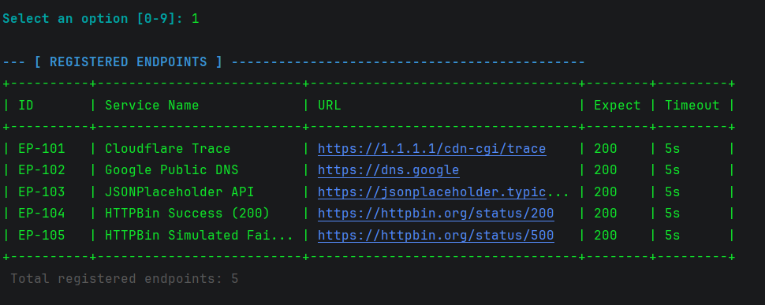
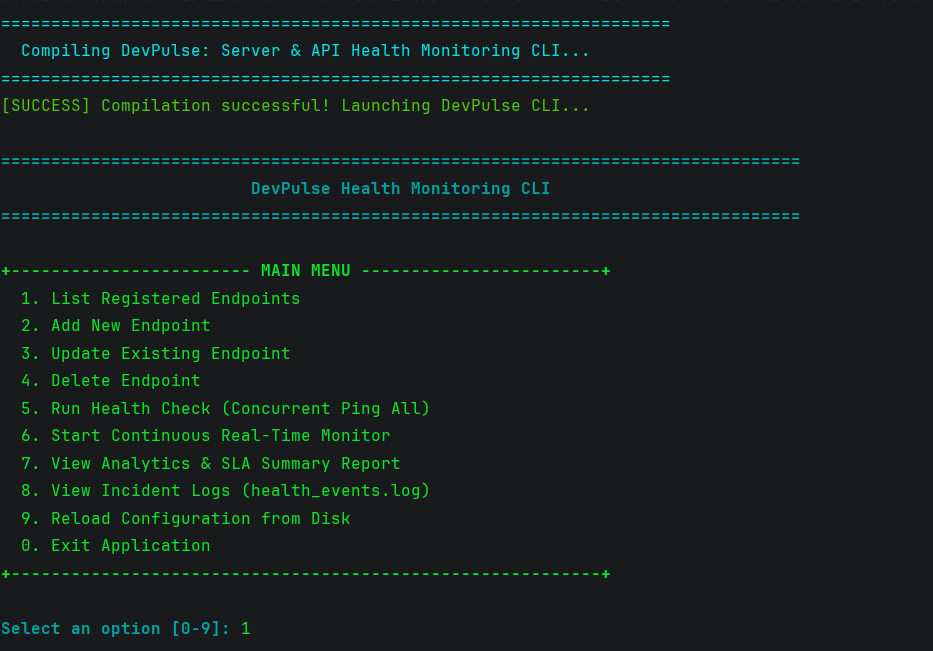
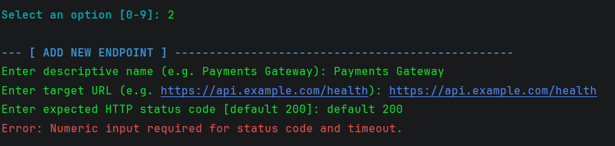
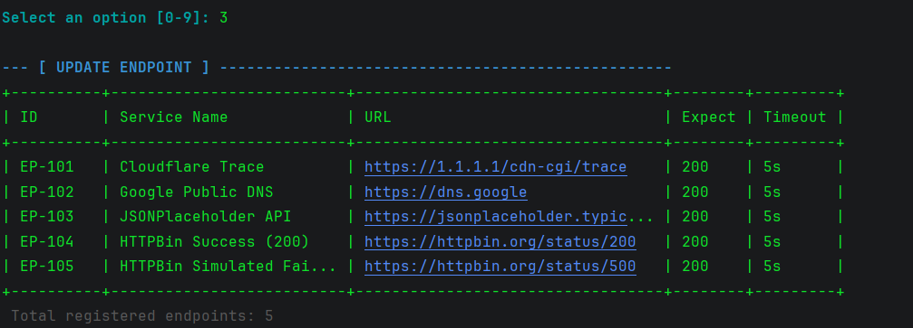
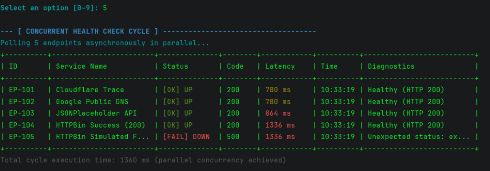

# DevPulse: Server & API Health Monitoring CLI

> **High-performance, lightweight, pure Java command-line interface for concurrent server and API health tracking, latency benchmarking, and SLA analytics.**

[](#prerequisites)
[](docs/ARCHITECTURE.md)
[](#key-features)
[](#interactive-menu-options)

---

## Overview

Modern software applications rely heavily on distributed web services and microservice architectures. When latency spikes or servers experience downtime, developers and operations teams require immediate diagnosis. **DevPulse** is an enterprise-grade, lightweight CLI monitoring solution engineered in **pure Java** with zero external dependencies.

DevPulse concurrently checks multiple HTTP and HTTPS targets using asynchronous network threads, records response times with millisecond precision, computes live uptime SLA percentages, and persistently audits incidents to local storage.

---

## Key Features

- ⚡ **Asynchronous Concurrency**: Built with Java's standard `CompletableFuture` and `java.net.http.HttpClient` to poll dozens of endpoints simultaneously, ensuring cycle execution time equals only the slowest single request.
- 🎯 **Sub-Millisecond Latency Benchmarking**: Uses `System.nanoTime()` timers to track min, average, and max latency.
- 📊 **Real-Time SLA & Analytics Dashboard**: Computes session uptime percentages, failure counts, and performance breakdowns per endpoint.
- 🚨 **Automated Incident Logging**: Records failed requests (status code mismatches, timeouts, DNS/connection drops) to `logs/health_events.log`.
- 💾 **File-Based Persistence**: Saves and manages endpoint configurations in standard CSV (`data/endpoints.csv`) with automatic seeding on first run.
- 🎨 **Modern CLI Presentation**: ANSI color-coded statuses, ASCII border layouts, responsive table formatting, and clear visual indicators (`[OK] UP`, `[FAIL] DOWN`, `[WARN] TIMEOUT`, `[ERR] ERROR`).
- 🔄 **Continuous Monitor Mode**: Real-time polling mode with configurable refresh intervals and background execution.

---

## Architecture & Package Structure

DevPulse follows strict object-oriented design and layered separation of concerns:

```
Vityarthi 2/
├── src/
│   └── com/
│       └── devpulse/
│           ├── main/
│           │   └── DevPulseApp.java             # Interactive CLI menu loop & entry point
│           ├── model/
│           │   ├── Endpoint.java                # Monitored target entity with CSV serialization
│           │   ├── HealthCheckResult.java       # Ping result, timing, and log formatting
│           │   └── ServiceStatus.java           # Enum: UP, DOWN, TIMEOUT, ERROR with ANSI colors
│           ├── repository/
│           │   └── FileHandler.java             # File I/O for data/endpoints.csv & logs/health_events.log
│           ├── service/
│           │   ├── RegistryService.java         # CRUD business logic and URL validation
│           │   ├── PollingEngine.java           # Asynchronous multithreaded HTTP polling engine
│           │   └── AnalyticsService.java        # SLA uptime %, latency stats, and incident dispatch
│           └── utils/
│               └── CLIFormatter.java            # ASCII banners, dynamic tables, and color helpers
├── data/
│   └── endpoints.csv                            # Persistent endpoint registry
├── logs/
│   └── health_events.log                        # Audited downtime and incident history
├── docs/
│   └── ARCHITECTURE.md                          # UML, Class, Use-Case & Sequence Diagrams
├── statement.md                                 # Academic problem statement and methodology
├── run.bat                                      # One-click Windows CMD compilation and run script
└── run.ps1                                      # One-click PowerShell compilation and run script
```

---

## Prerequisites

- **Java Development Kit (JDK)**: Version 11 or higher (OpenJDK, Oracle JDK, or Temurin).
- No external libraries, Gradle, or Maven installations needed!

---

## Quick Start & Running Instructions

### Option 1: Using Windows Batch Script (`run.bat`)
Double-click `run.bat` or run from Command Prompt:
```cmd
run.bat
```

### Option 2: Using PowerShell Script (`run.ps1`)
```powershell
.\run.ps1
```

### Option 3: Manual Compilation & Execution
From the root project directory:
```powershell
# 1. Compile all Java source files into bin directory
javac -d bin (Get-ChildItem -Path src -Filter *.java -Recurse | Select-Object -ExpandProperty FullName)

# 2. Run the interactive CLI application
java -cp bin com.devpulse.main.DevPulseApp
```

### Option 4: Headless Automated Smoke Test (CI/CD Mode)
To run a one-shot automated batch health check across all endpoints without entering interactive menu mode:
```powershell
java -cp bin com.devpulse.main.DevPulseApp --check-once
```

---

## Interactive Menu Options

When launched, DevPulse presents an interactive command center:

```
================================================================================
                         DevPulse Health Monitoring CLI                         
================================================================================

+------------------------ MAIN MENU ------------------------+
  1. List Registered Endpoints
  2. Add New Endpoint
  3. Update Existing Endpoint
  4. Delete Endpoint
  5. Run Health Check (Concurrent Ping All)
  6. Start Continuous Real-Time Monitor
  7. View Analytics & SLA Summary Report
  8. View Incident Logs (health_events.log)
  9. Reload Configuration from Disk
  0. Exit Application
+-----------------------------------------------------------+

Select an option [0-9]:
```

---

## Screenshots

### 1. Main Menu Interface


### 2. List Registered Endpoints


### 3. Add & Validate New Endpoint


### 4. Update Existing Endpoint


### 5. Concurrent Health Check Cycle


---

## License & Academic Compliance
Developed strictly following object-oriented software engineering principles for academic evaluation and real-world developer productivity. All source code contains comprehensive JavaDoc comments.
