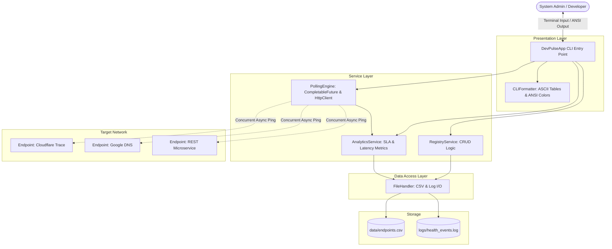
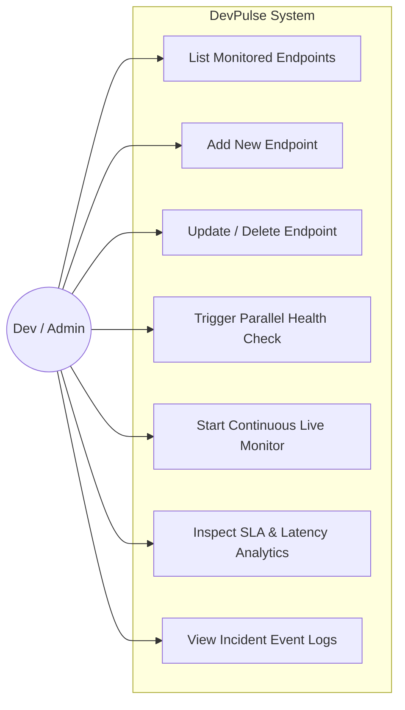
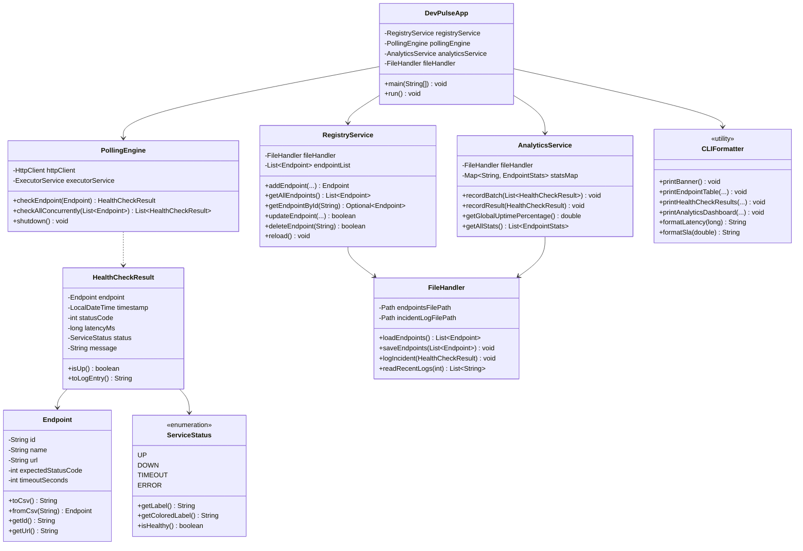
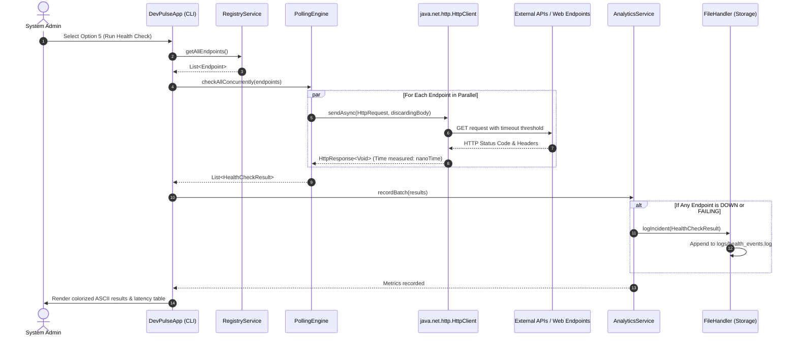

# DevPulse Architecture & Design Specification

DevPulse is engineered according to a classic 3-Tier Layered Architecture with decoupled responsibilities across Presentation, Service, Model, and Persistence layers.

---

## 1. System Architecture Diagram

---

## 2. Use Case Diagram

---

## 3. Class Diagram

---

## 4. Sequence Diagram (Concurrent Health Check Polling Cycle)

